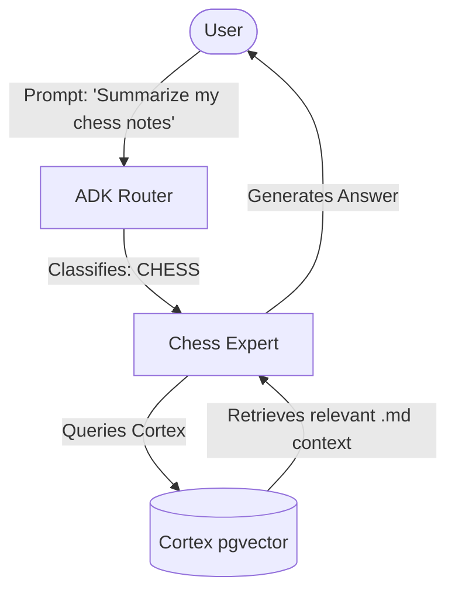
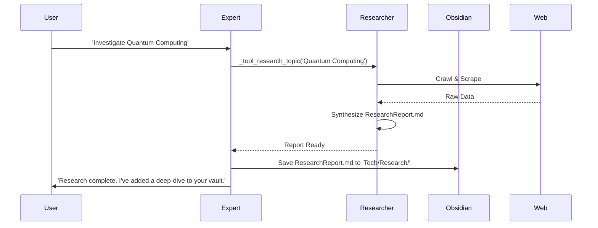

# Wisdom Expert User Guide: Workflows & Integrations

This guide explains how to interact with Wisdom's Mix of Experts (MoE) architecture, how to connect your existing knowledge bases (Obsidian), and how to leverage AI for autonomous content creation.

## 1. Connecting an Existing Obsidian Vault
Wisdom is designed to live on top of your existing Obsidian vault. To connect a specific domain expert to your vault:

### Configuration Steps
1.  **Open the Expert Registry**: In the Wisdom Portal, navigate to the **Expert Registry** view.
2.  **Define the Path**: When creating or editing an expert, set the `obsidian_folder` property.
    *   Example: For a `CHESS` expert, set it to `Chess/`.
3.  **Map the Codebase/Folder**: Use the **Map Codebase** button in the sidebar. Enter the absolute path to your Obsidian vault root.
4.  **Cortex Ingestion**: Wisdom will crawl the specified folder, generate embeddings for all `.md` files, and store them in the `Cortex` semantic substrate.

### Usage Diagram

## 2. Creating AI-Generated Knowledge (Obsidian/Anki)
You can use Wisdom agents to generate new structured knowledge from scratch or from research.

### Case A: Interactive Distillation
1.  Chat with an expert in the **Conversational** view.
2.  Once you reach a significant insight, click **Distill into Note**.
3.  The expert will format the conversation into a PARA-compliant Markdown file and save it directly to your mapped Obsidian folder.

### Case B: Autonomous Research
If you ask about a topic the expert doesn't know, or explicitly trigger research:

## 3. Creating "Obsidians with IA" (AI-Powered Vaults)
You can bootstrap entire knowledge spaces by chaining experts and the researcher.

### Workflow:
1.  **Register a New Domain**: e.g., `BIOHACKING`.
2.  **Trigger Initial Research**: "Research the top 10 longevity protocols for 2026."
3.  **Auto-Generation**: The `Researcher` will create the initial folder structure and core notes.
4.  **Refinement**: Use the **Note Editor** in the Portal. Click **Polish with Gemini** to expand definitions, add wikilinks to other parts of your vault, or generate Anki cards for technical terms.

## 4. Key Integration Shortcuts
| Task | Action | Result |
| :--- | :--- | :--- |
| **Map Vault** | Sidebar → Map Codebase | Entire vault becomes semantically searchable by AI. |
| **Add Expert** | Registry → New Expert | Custom routing and isolated memory for a new topic. |
| **Generate Cards** | Note Editor → 'Ankify' | Converts Markdown headers/lists into Anki flashcards. |
| **Verify Sync** | Mission Control → Service Status | Ensure `adk-router` and `cortex` are online. |

---

> [!IMPORTANT]
> **Path Consistency**: Ensure that the `obsidian_folder` in the expert config matches the actual folder name in your vault (case-sensitive).
